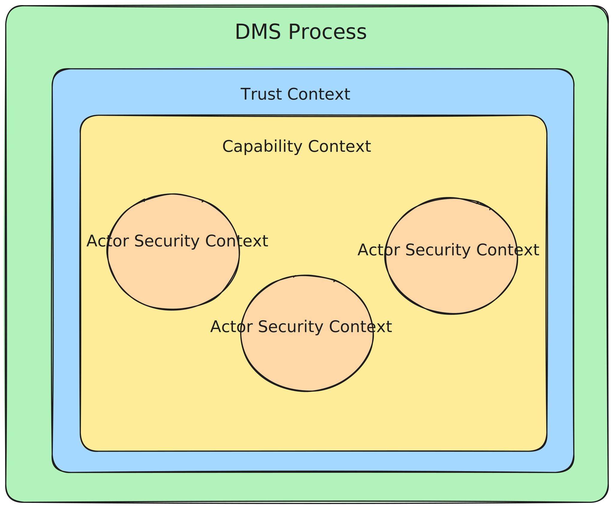
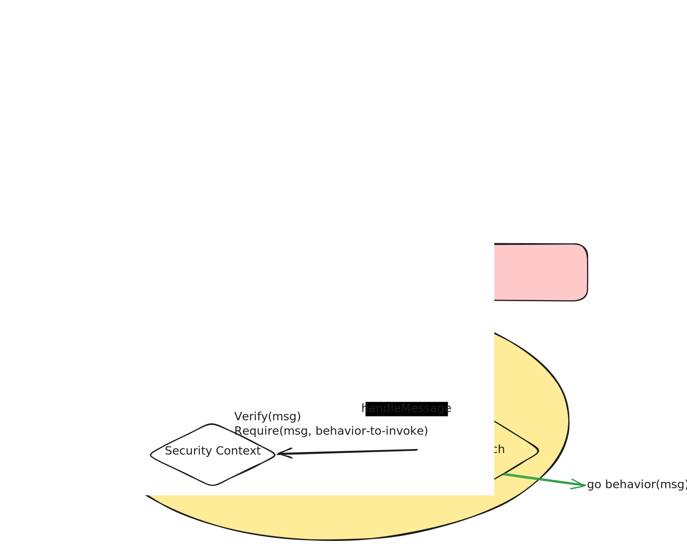
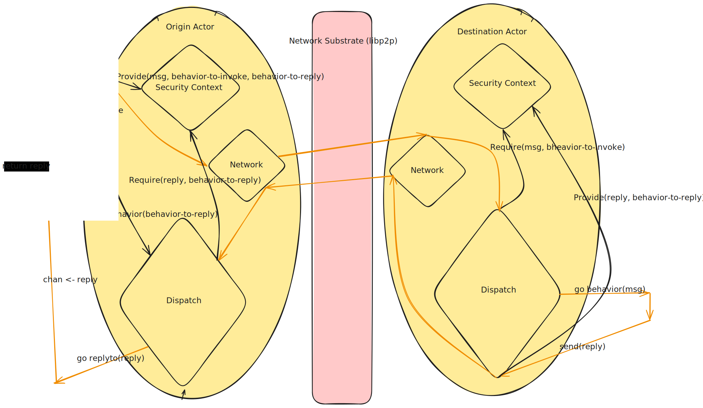
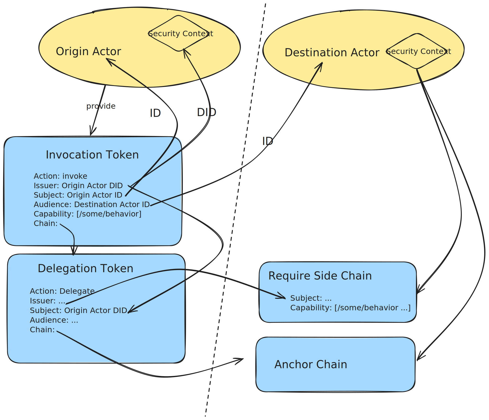

# NuActor: Secure Actor Programming in Decentralized Systems

`NuActor` is a framework designed for secure actor oriented
programming in decentralized systems. The framework utilizes zero
trust interactions, whereby every message is authenticated
individually at the point of interaction. The system supports
fine-grained capabilities, anchored in decentralized identifiers
(see [DID](https://www.w3.org/TR/did-core/))
and effected with user controlled authorization networks
(see [UCAN](https://github.com/ucan-wg/)).

## Secure Interactions in Decentralized Systems

Decentralized systems are distributed systems where there are
different stake holders and controlling entities who are _mutually
distrustful_. Actors are ideally suited for modeling and programming
such systems, as they are able to express concurrency, distribution,
and agency on behalf of their controllers.

However, given the open ended computing nature of decentralized
systems, there is a fundamental problem in _securing interactions_.
Because the system is open, there is effectively _no perimeter_; the
messages are coming from the Internet, and can potentially
originate in malicious or hostile actors.

NuActor takes the following approach:
- The only entity an actor can fully trust is itself and its controller.
- All messages invoking a behavior carry with them capability tokens
  that authorize them to perform the invocation.
- Invocations are checked at dispatch so that it is always verified
  whether an invocation is allowed, anchored on the entities the actor
  trusts for the required capabilities.
- There is no central authority; every entity (identified by a DID) can
  issue their own capability tokens and anchor trust wherever they want.
- There are certain entities in the open public networks that may
  be _marginally trusted_ to vet users (KYC) for invoking public behaviors.
  The set of such entities is open, and everyone is free to trust whoever they want.
  The creators of the network at bootstrap are good candidates for such entities.
- Trust is ephemeral and can be revoked at all times.
- In effect, users are in control of authorization in the network (UCAN!)

## Capabilities
### Behaviors and the Capability Namespace

Capabilities are defined in a hierarchical namespace, akin to the UNIX
file system structure. The root capability, which implicitly has all
other capabilities, is `/`. Every other capability extends this path,
separating the namespace with additional `/`s. A capability is
narrower than another if it is a subpath in the UNIX sense. So `/A`
imples `/A/B` and so on, but `/A` does not imply `/B`.

Behaviors have names that directly map to capabilities. So the
behavior namespace is also hierarchical, allowing for easy automated
matching of behaviors to capabilities.

### Capability Tokens

Capabilities are expressed with a token, which is a structured object
signed by the private key of the issuer. The issuer is in the token as
a DID, which allows any entity inspecting the token to verify by
retrieving the public key associated with the DID. Typically these are
key DIDs, which embed the public key directly.

The structure of the token is as following:
```go
type Token struct {
	// DMS tokens
	DMS *DMSToken `json:"dms,omitempty"`
}

type DMSToken struct {
	Action     Action       `json:"act"`
	Issuer     did.DID      `json:"iss"`
	Subject    did.DID      `json:"sub"`
	Audience   did.DID      `json:"aud"`
	Topic      []Capability `json:"topic,omitempty"`
	Capability []Capability `json:"cap"`
	Nonce      []byte       `json:"nonce"`
	Expire     uint64       `json:"exp"`
	Depth      uint64       `json:"depth,omitempty"`
	Chain      *Token       `json:"chain,omitempty"`
	Signature  []byte       `json:"sig,omitempty"`
}
```

The `Subject` is the DID of the entity to which the `Issuer` grants
(if the chain is empty) or delegates the capabilities listed in the
`Capability` field and the broadcast topics listed in the `Topic`
field.  The audience may be empty, but when present it restricts the
receiver of invocations to a specified entity.

The `Action` can be any of `Delegate`, `Invoke` or `Broadcast`, with
revocations to be added in the very near future.

If the `Action` is `Delegate` then the `Issuer` confers to the
`Subject` the ability to further create new tokens, _chained_ on this
one.

If the `Action` is `Invoke` or `Broadcast`, then the token confers to the
`Subject` the capability to make an invocation or broadcast to a behavior.
Such tokens are terminal and cannot be chained further.

The `Chain` field of the token inlines the chain of tokens (could be a
single one) on which the capability transfer is anchored on.

Note that the delegation spread can be restricted by the issuer of a
token using the `Depth` field. If set, it is the maximum chain depth
at which a token can appear. If it appears deeper in the chain, the
token chain fails verification.

Finally, all capabilities have an expiration time (in UNIX nanoseconds).
An expired token cannot be used any more and fails verification.

### Anchors of Trust

In order to sign and verify token chains, the receiver needs to
install some trust anchors.  Specifically, we distinguish 3 types of
anchors:
- **root anchors** which are DIDs that are fully trusted for input
  with implicit root capability. Any valid chain anchored on one of
  our roots will be admissible.
- **require anchors** which are tokens that act as side chains for
  marginal input trust.  These tokens admit a chain anchored in their
  subject, as long as the capability and depth constraints are
  satisfied.
- **provide anchors** which are tokens that anchour the actor's output
  invocation and broadcast tokens. These are delegations which the
  actor can use to prove that it has the required capabilities, beside
  self-signing.

### Token Chain Verification

The token chain is verified with strict rules:
- The entire chain must not have expired.
- Each token in the chain cannot expire before its chain.
- Each token must match the Issuer with the Subject of its chain.
- Each token in the chain can only narrow (attenuate) the capabilities
  of its chain.
- Each token in the chain can only narrow the audience; an empty
  audience ("to whom it may concern") can only be narrowed once
  to an audience DID and all chains build on top must concern the
  same audience.
- The chain of a token can only delegate.
- The signature must verify.
- The whole chain must recursively verify.


## Programming NuActors

### The `actor` package

The Go implementation of NuActor lives in the `actor` package of [DMS](https://gitlab.com/nunet/device-management-service/).

To use it:
```go
import "gitlab.com/nunet/device-management-service/actor"
```

The network substrate for NuActor is currently implemented with [libp2p](https://github.com/libp2p/go-libp2p), with broadcast using [gossipsub](https://github.com/libp2p/go-libp2p-pubsub).

### The Security Context

Each actor has a key pair for signing its messages; the actor's id is the public key itself and is embedded in every message it sends. The private key for the actor lives inside the actor's `SecurityContext`.

In general:
- each actor has its own `SecurityContext`; however, if the actor
  wants to create multiple subactors and act as an ensemble, it can
  share it.
- the key pair is ephemeral; however, the root actor in the process
  has a persistent key pair, which matches the libp2p key and Peer
  ID. This makes the actor reachable by default given its Peer ID or
  DID.
- every actor in the process shares a DID, which is the ID of the root
  actor.

Each `Security Context` is anchored in a process wide
`CapabilityContext`, which stores anchors of trust and ephemeral tokes
consumed during actor interactions.

The `CapabilityContext` itself is anchored on a TrustCotext, which
contains the private key for the root actor and the process itself.

The following diagram depicts this relathionship:


### Actor Handles
```go
type Handle struct {
	ID      ID      `json:"id"`
	DID     DID     `json:"did"`
	Address Address `json:"addr"`
}

type Address struct {
	HostID       string `json:"host,omitempty"`
	InboxAddress string `json:"inbox,omitempty"`
}

```
### Messages
```go
type Envelope struct {
	To         Handle          `json:"to"`
	Behavior   string          `json:"be"`
	From       Handle          `json:"from"`
	Nonce      uint64          `json:"nonce"`
	Options    EnvelopeOptions `json:"opt"`
	Message    []byte          `json:"msg"`
	Capability []byte          `json:"cap,omitempty"`
	Signature  []byte          `json:"sig,omitempty"`

	Discard func() `json:"-"`
}

type EnvelopeOptions struct {
	Expire  uint64 `json:"exp"`
	ReplyTo string `json:"cont,omitempty"`
	Topic   string `json:"topic,omitempty"`
}

```
### The Actor Interfaces
```go
type Actor interface {
	Context() context.Context
	Handle() Handle
	Security() SecurityContext

	AddBehavior(behavior string, continuation Behavior, opt ...BehaviorOption) error
	RemoveBehavior(behavior string)

	Receive(msg Envelope) error
	Send(msg Envelope) error
	Invoke(msg Envelope) (<-chan Envelope, error)

	Publish(msg Envelope) error
	Subscribe(topic string, setup ...BroadcastSetup) error

	Start() error
	Stop() error

	Limiter() RateLimiter
}
```

### Sending Messages

The following code shows how to send a message at the call site:
```go
	msg, _ := actor.Message(
		myActor.Handle(),
		destinationHandle,
		"/some/behavior",
		MyMessage{ /*...*/ },
	)
	_ = myActor.Send(msg)
```

At the receiver this is how we can react to the message:
```go
	_ = myActor.AddBehavior("/some/behavior", func(msg Envelope) {
		defer msg.Discard()
		// process message
	})

```

Notice the `_` for errors, please don't do this in production.

### Interactive Invocations

Interactive invocations are a combinations of a synchronous send and wait for a reply.

At the call site:
```go
	msg, _ := actor.Message(
		myActor.Handle(),
		destinationHandle,
		"/some/behavior",
		MyMessage{ /*...*/ },
	)
	replyChan, _ := myActorInvoke(msg)
	reply := <-replyChan
	defer reply.Discard()
	// process reply ...
```

At the receiver this is how we can create an interactive behavior:
```go
	_ = myActor.AddBehavior("/some/behavior", func(msg Envelope) {
		defer msg.Discard()
		reply, _ := actor.ReplyTo(
			msg
			MyReply{ /*...*/ },
		)
		_ = mayActor.Send(MyReply)
	})
```

Again, notice the `_` for errors, please don't do this in production.

### Broadcast
We can easily broadcast messages to all interested parties in a topic.

At the broadcast site:
```go
	msg, _ := actor.Message(
		myActor.Handle(),
		destinationHandle,
		"/some/broadcast/behavior",
		MyMessage{ /*...*/ },
		actor.WithMessageTopic("/some/topic"),
	)
	_ = actor.Publish(msg)
```

At the receiver:
```go
	_ = myActor.Subscribe("/some/topic")
	_ = myActor.AddBehavior("/some/broadcast/behavior", func(msg Envelope) {
		defer msg.Discard()
		// process the message
	}, actor.WithBehaviorTopic("/some/topic"),
	)
```

### Discarding Capability Tokens
Notice all these `defer msg.Discard()` in the examples above; this is
necessary to ensure deterministic cleanup of tokens exchanged during
the interaction. Please do not forget that.


## Behind the Scenes
### Sending a Message


### Invoking a Behavior


### Verifying Capabilities

